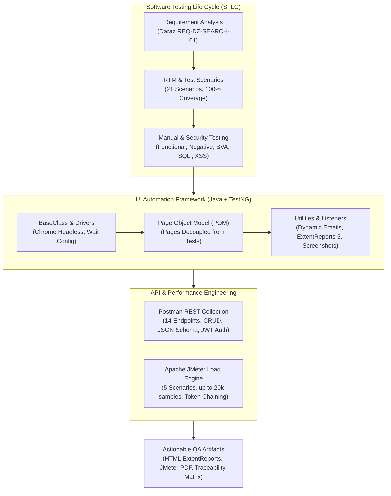

# 🎯 Software Quality Assurance (QA) & Test Automation Portfolio
### **Prasanga Niraula**
**QA Engineer | Test Automation & Performance Specialist**  
📍 Lalitpur / Kathmandu, Nepal &nbsp;|&nbsp; 📧 [prasanganiraula2016@gmail.com](mailto:prasanganiraula2016@gmail.com) &nbsp;|&nbsp; 🌐 [Interactive React Portfolio](./react-portfolio/)

---

[](https://www.oracle.com/java/)
[](https://www.selenium.dev/)
[](https://testng.org/)
[](https://maven.apache.org/)
[](https://www.postman.com/)
[](https://jmeter.apache.org/)
[](https://www.extentreports.com/)
[](https://www.jenkins.io/)

---

## 📌 Executive Summary

Results-driven **Quality Assurance Engineer** with comprehensive hands-on expertise spanning the complete **Software Testing Life Cycle (STLC)**. Trained and certified through the intensive QA & Automation program at **[TechAxis](https://techaxis.com.np/)**. 

Proven ability to architect enterprise-grade **Page Object Model (POM)** test automation frameworks using **Java, Selenium WebDriver, and TestNG**, conduct rigorous **REST API testing with Postman** (including dynamic parameterization, JSON Schema verification, and chained JWT authentication), execute **concurrency and stress load testing with Apache JMeter** (benchmarking up to 20,000 samples and diagnosing token authorization bottlenecks), and craft formal **Requirement Traceability Matrices (RTM)**, test scenarios, and security test cases.

---

## 🛠️ Technical Competency Matrix

| Testing Domain | Technologies, Frameworks & Tools | Key Methodologies & Techniques |
| :--- | :--- | :--- |
| **Manual Testing** | Jira concepts, Excel, Test Case Design, RTM | Equivalence Partitioning (EP), Boundary Value Analysis (BVA), Decision Tables, Exploratory Testing, Smoke & Regression Testing |
| **UI Test Automation** | Java, Selenium WebDriver, TestNG, Maven, ExtentReports 5 | Page Object Model (POM), Headless Execution, Dynamic Locators, Automated Failure Screenshots, Listeners, Email Reporting |
| **API Testing** | Postman, REST APIs, JSON Schema (draft-07), Newman | CRUD Lifecycle Validation, Pre-request Scripts, Variable Chaining (JWT Bearer Token), SLA Response Time Assertions |
| **Performance Testing** | Apache JMeter, HTTP Request Samplers, CSV Data Set Config | Multi-Scenario Concurrency, Thread Groups, Ramp-Up Tuning, JSON Extractors, Uniform Random Timers, SLA Latency Percentiles |
| **Security & Edge Testing** | OWASP Top 10 concepts, Input Sanitization Payloads | SQL Injection testing (`' OR 1=1 --`), XSS Script Injection (`<script>`), Brute-force Lockout Verification, Session Inactivity Expiry |
| **CI/CD & DevOps** | Git, GitHub, Maven Surefire, Headless Chrome, Jenkins-ready scripts | Automated build verification, test suite execution via XML, artifact generation |

---

## 🏗️ Architecture & Testing Ecosystem



---

## 📂 Featured QA Projects

### 1. 📋 Specification-Driven Manual Testing & Requirement Traceability (Daraz.com.np)
*📁 Directory:* [`Manual Test Cases /Daraz Manual/`](./Manual%20Test%20Cases%20/Daraz%20Manual/)  
*Key Artifacts:* [`DarazTestCases.xlsx`](./Manual%20Test%20Cases%20/Daraz%20Manual/DarazTestCases.xlsx) &nbsp;|&nbsp; [`Requirements_Daraz_Search_Feature-239963.pdf`](./Manual%20Test%20Cases%20/Daraz%20Manual/Requirements_Daraz_Search_Feature-239963.pdf)

* **Context:** Comprehensive quality engineering validation for the Product Search and Filter feature of Nepal's leading e-commerce platform ([Daraz.com.np](https://www.daraz.com.np/)), derived strictly from formal specification document `REQ-DZ-SEARCH-01`.
* **Test Design & Structure:**
  * **21 High-Level Test Scenarios (`TS-01` to `TS-21`)** mapping directly to functional (`REQ-01` to `REQ-17`) and non-functional (`REQ-18` to `REQ-21`) requirements.
  * **Granular Test Cases (`TC-01` to `TC-17d`)** with explicit Preconditions, step-by-step Test Steps, Test Data sets, and Expected Results.
  * **Traceability Guarantee:** 100% Requirement-to-Test coverage matrix linking every requirement ID to its respective scenario and test case execution statuses.
* **Test Coverage Highlights:**
  * **Search & Auto-Suggestions:** Header persistence, keyword queries, case-insensitivity validation, and dynamic auto-suggest dropdown verification.
  * **Multi-Filter Combination Logic:** Independent and compound filtering by Price Range (Min/Max), Brand, Customer Rating (4 stars & above), Location, and Free Shipping.
  * **Sorting Verification:** Validated all 5 sort options: Popularity, Price (Low to High), Price (High to Low), Newest, and Top Rating.
  * **Product Card Metadata Validation:** Rigorous checks for product image loading, title truncation/accuracy, current price, promotional discount percentages, and average review stars.
  * **Negative & Edge Cases:** Zero search results ("No results found" fallback), special character/emoji handling, leading/trailing whitespace sanitization, and 3-second SLA performance criteria.

---

### 2. 🔐 Enterprise Authentication, Edge-Case & Security Testing Suite
*📁 Directory:* [`Manual Test Cases /Second/`](./Manual%20Test%20Cases%20/Second/)  
*Key Artifacts:* [`AssignmentEdited.xlsx`](./Manual%20Test%20Cases%20/Second/AssignmentEdited.xlsx) &nbsp;|&nbsp; [`apitest1.csv`](./Manual%20Test%20Cases%20/Second/apitest1.csv)

* **Context:** End-to-end functional and security audit of an enterprise authentication subsystem, evaluating authentication integrity, field validation constraints, and vulnerability resistance.
* **Coverage Matrix:**
  * **Functional & Boundary Combinations:** Valid username/email + valid password, invalid credentials, mismatched combinations, and blank field validation.
  * **Session Management:** Verification of session expiration and automatic logout after defined periods of user inactivity.
  * **Brute-Force Attack Mitigation:** Account lockout threshold verification after consecutive failed login attempts (`TC-05`).
  * **Application Security (AppSec):**
    * **SQL Injection (SQLi):** Tested authentication bypass resistance using injection strings (`' OR 1=1 --`) in input vectors (`TC-09`).
    * **Cross-Site Scripting (XSS):** Tested reflected script injection resistance using `<script>` payloads in username and password fields (`TC-09a`).
    * **Visual Privacy:** Verified masking of input characters inside the password field (`TC-04`).

---

### 3. 🤖 Web UI Automation Frameworks (Java + Selenium WebDriver + TestNG)
*📁 Directory:* [`Automation/`](./Automation/)  
*Projects Included:*
- **Framework A: Automation Exercise Enterprise Suite** ([`Automation/AutomationQA/AutomationExercises/`](./Automation/AutomationQA/AutomationExercises/))
- **Framework B: SauceDemo Headless CI/CD Suite** ([`Automation/AutomationExam/`](./Automation/AutomationExam/))

#### Key Architectural Highlights:
1. **Page Object Model (POM) Design Pattern:**
   * Clean separation between Page Locators/Actions (e.g. `LoginPage.java`, `CartPage.java`, `TestCase1Page.java`) and Test Assertions (`LoginTestCases.java`, `CartTestCases.java`).
   * Eliminates code duplication, prevents flaky locators, and maximizes maintainability.
2. **From Procedural to Production:**
   * Demonstrates the progression from baseline procedural scripts (`WithoutPOM/TestCase1RegisterUser.java`) to scalable enterprise POM architectures (`UsingPOM/`).
3. **Advanced Test Data Generation & Idempotency:**
   * Developed `EmailsUtils.java` to generate unique, timestamped dynamic email addresses (`"testuser" + System.currentTimeMillis() + "@gmail.com"`), preventing database collision errors on automated user registration tests (`TestCase1RegisterUser`).
4. **9-Case Decision Table Authentication Testing (`AutomationExam`):**
   * Implemented full decision table coverage on SauceDemo:
     * Valid/Valid (`standard_user` + `secret_sauce` -> Lands on Products dashboard)
     * Valid/Invalid, Valid/Empty, Invalid/Valid, Invalid/Invalid, Invalid/Empty, Empty/Valid, Empty/Invalid, Empty/Empty with exact error banner assertions (`"Epic sadface: ..."`).
5. **Cart Workflow & State Validation:**
   * Verified item addition to cart, button state toggle to `"Remove"`, removal from cart, and button rollback to `"Add to cart"`.
6. **Headless Execution & CI/CD Readiness:**
   * Standardized `BaseClass.java` configured with modern headless Chrome options (`--headless=new`, `--no-sandbox`, `--disable-dev-shm-usage`, `--disable-gpu`, 1920x1080 resolution), perfectly optimized for Docker containers and Jenkins agents.
7. **Comprehensive HTML Reporting & Failure Capture:**
   * Integrated **ExtentReports 5** with `CustomTestListener.java` (`ITestListener`) and `ExtentReporterManagerSS.java` to capture timestamped screenshots automatically upon test failure and embed them directly into HTML test reports.
   * Automated test execution dispatch via Jakarta Mail (`EmailsUtils.java`).

```bash
# Execute SauceDemo Headless Suite:
cd "Automation/AutomationExam"
mvn clean test

# Execute AutomationExercise POM Suite:
cd "Automation/AutomationQA/AutomationExercises"
mvn test -DsuiteXmlFile=src/test/java/AutomationTestCases/UsingPOM/testing.xml
```

---

### 4. ⚡ REST API Testing & Automation (Postman + JSON Schema + Newman)
*📁 Directory:* [`API Testing/`](./API%20Testing/)  
*Key Artifact:* [`Platzi API.postman_collection.json`](./API%20Testing/Platzi%20API.postman_collection.json)

* **Target API:** Platzi Fake Store REST API ([`https://api.escuelajs.co/api/v1/`](https://api.escuelajs.co/api/v1/))
* **Scope:** 14 automated API requests covering the full product and authentication lifecycle.
* **Core Capabilities Demonstrated:**
  * **Full CRUD Testing:** `GET /products`, `GET /products/:id`, `GET /products/slug/:slug`, `POST /products/` (create), `PUT /products/:id` (update), `DELETE /products/:id`.
  * **Dynamic Pre-Request Scripting:** Generated dynamic unique product titles per request run using JavaScript:
    ```javascript
    pm.variables.set("randomTitle", "Prasanga-" + Date.now());
    ```
  * **Automated Context Chaining:** Extracted `id` from the creation response body and stored it in collection variables (`productId`) to feed downstream `PUT` and `DELETE` requests automatically.
  * **JWT Authentication Chaining:** Authenticated via `POST /auth/login`, parsed the JSON response, dynamically extracted `access_token`, and injected it as a Bearer token into subsequent `GET /auth/profile` requests.
  * **JSON Schema Validation (draft-07):** Applied strict schema assertions on `GET /products` to validate nested payload types, mandatory keys (`id`, `title`, `price`, `description`, `images`, `category`), and structure.
  * **SLA Performance & Status Assertions:** Validated HTTP status codes (`200 OK`, `201 Created`), payload integrity, and response times under 3500ms.

```bash
# Run Postman Collection via Newman CLI:
newman run "API Testing/Platzi API.postman_collection.json" \
  --reporters cli,htmlextra \
  --reporter-htmlextra-export api-report.html
```

---

### 5. 📊 Concurrency & Load Testing (Apache JMeter)
*📁 Directory:* [`Jmeter/`](./Jmeter/)  
*Key Artifacts:* [`QA TechAxis.jmx`](./Jmeter/QA%20TechAxis.jmx) &nbsp;|&nbsp; [`data.csv`](./Jmeter/data.csv) &nbsp;|&nbsp; [`JmeterReportEdited.pdf`](./Jmeter/JmeterReportEdited.pdf)

* **Target Application:** RemoteAxle Authentication & User Profile Services (`https://devapi.remoteaxle.com/`)
* **Test Plan Architecture:**
  * **Data-Driven Parameterization:** `CSV Data Set Config` recycling 10 user credential records (`data.csv`). One record was intentionally configured with invalid credentials to simulate a real-world 10% baseline failure rate.
  * **Chained Sampler Execution:**
    1. `POST /login` -> HTTP Header Manager (`Content-Type: application/json`)
    2. `JSON Extractor` -> Target variable `token`, Expression: `$.data.access_token`
    3. `GET /users/profile` -> Chained header: `Authorization: Bearer ${token}`
  * **Uniform Random Timer:** Simulated realistic human think time with a base constant delay offset of 2000ms and a random delay maximum of 1000ms:
    $$\text{Effective Delay} = (0.1 \times \text{Random Delay}) + 2000\,\text{ms}$$
  * **Assertions:** Response Code Assertion (200), Response Message Assertion, and Size Assertions.

#### 📈 Execution Scenarios & Load Benchmark Results

| Scenario | Threads (Users) | Ramp-Up | Loop Count | Total Samples | Login Avg (ms) | Profile Avg (ms) | Login Error % | Profile Error % | Total Error % |
| :---: | :---: | :---: | :---: | :---: | :---: | :---: | :---: | :---: | :---: |
| **1 (Baseline)** | 1 | 1s | 1 | 2 | 754 ms | 212 ms | 0.00% | 0.00% | 0.00% |
| **2 (Light Load)** | 10 | 10s | 10 | 200 | 580 ms | 169 ms | 10.00% | 10.00% | 10.00% |
| **3 (Stress)** | 100 | 20s | 5 | 1,000 | 681 ms | 69 ms | 10.00% | 93.40% | 51.70% |
| **4 (Peak Stress)**| 200 | 20s | 10 | 4,000 | 3,930 ms | 74 ms | 10.00% | 91.35% | 50.68% |
| **5 (Sustained)** | 100 | 100s | 100 | 20,000 | 928 ms | 160 ms | 10.00% | 93.32% | 51.66% |

#### 🔍 Critical Performance Engineering Insights:
1. **Token Authorization Bottleneck:** Login API error rate stayed rock-solid at **10.00%** across all multi-user scenarios (exactly matching the 1 invalid row in the 10-row CSV). However, Profile API errors spiked to **91–93%** under heavy concurrency (Scenarios 3–5). This proved conclusively that downstream failures were caused by authentication token generation or rate-limiting bottlenecks under concurrent load, rather than invalid credentials.
2. **Latency Degradation at Peak Concurrency:** At 200 concurrent threads (Scenario 4), Login API response time surged from a 754ms baseline to an average of **3,930ms**, with a 99th percentile of **5,905ms** and a maximum peak of **9,389ms**.
3. **Ramp-Up Impact on Server Stability:** Comparing Scenario 3 (20s ramp-up) to Scenario 5 (100s ramp-up) demonstrated that gradual traffic ramp-up reduces instantaneous thread contention on the auth server.

---

## 📁 Repository Directory Structure

```plaintext
QA Portfolio/
├── index.html                           # Modern interactive web portfolio dashboard
├── README.md                            # Comprehensive portfolio documentation (this file)
│
├── Manual Test Cases /                  # Pillar 1: Manual & Security Testing
│   ├── README.md                        # Documentation & scenario matrix
│   ├── Daraz Manual/
│   │   ├── Requirements_Daraz_Search_Feature-239963.pdf  # Source requirements doc (REQ-DZ-SEARCH-01)
│   │   └── DarazTestCases.xlsx          # 21 Scenarios, detailed test cases & complete RTM
│   └── Second/
│       ├── AssignmentEdited.xlsx        # Auth, Edge-Case, SQLi & XSS Security Test Suite
│       └── apitest1.csv                 # Multi-user data parameterization sheet
│
├── Automation/                          # Pillar 2: Selenium Web UI Automation
│   ├── README.md                        # Framework architecture and execution guide
│   ├── AutomationExam/                  # Project A: SauceDemo Headless CI/CD Suite
│   │   ├── pom.xml                      # Maven dependencies (Selenium 4.47, TestNG, ExtentReports)
│   │   ├── testng.xml                   # Suite execution descriptor
│   │   └── src/test/java/AutomationExam/
│   │       ├── BaseClass/BaseClass.java # Headless Chrome CI/CD driver configuration
│   │       ├── Pages/                   # Page Object Model (LoginPage, CartPage)
│   │       └── TestCases/               # 9-case Auth Decision Table & Cart Test Cases
│   └── AutomationQA/                    # Project B: AutomationExercise Enterprise Suite
│       ├── JavaBasics/                  # Core Java OOP fundamentals (Inheritance, Polymorphism)
│       └── AutomationExercises/         # Enterprise Maven test automation project
│           ├── pom.xml                  # ExtentReports 5, Jakarta Mail, Selenium
│           ├── reports/                 # Generated HTML Extent test reports
│           └── src/test/java/
│               ├── AutomationTestCases/
│               │   ├── UsingPOM/        # Production Page Object Model implementation
│               │   │   ├── BaseClass.java
│               │   │   ├── Utilities/   # Custom listeners, screenshot capturers, email dispatches
│               │   │   └── TestCase1..5 # User registration, login, logout, negative flows
│               │   └── WithoutPOM/      # Procedural baseline scripts
│               └── Day1..4/             # Daily hands-on practice & browser workarounds
│
├── API Testing/                         # Pillar 3: Postman REST API Testing
│   ├── README.md                        # Endpoint map, schema validation & Newman execution
│   └── Platzi API.postman_collection.json # 14 Requests: CRUD, JSON Schema, JWT Chaining
│
└── Jmeter/                              # Pillar 4: Performance & Load Testing
    ├── README.md                        # Performance analysis, scenario reports & insights
    ├── QA TechAxis.jmx                  # Complete Apache JMeter test plan
    ├── data.csv                         # 10 Parameterized test credential records
    └── JmeterReportEdited.pdf           # Formal Performance Benchmark & Analysis Report
```

---

## 💻 Quick Start & Test Execution Guide

### 1. Execute UI Automation (SauceDemo Suite)
```bash
cd "Automation/AutomationExam"
mvn clean test
```

### 2. Execute UI Automation (Automation Exercise Suite)
```bash
cd "Automation/AutomationQA/AutomationExercises"
mvn clean test
# Or
mvn test -DsuiteXmlFile=src/test/java/AutomationTestCases/UsingPOM/testing.xml
```

### 3. Run Postman API Collection via Newman
```bash
npm install -g newman newman-reporter-htmlextra
newman run "API Testing/Platzi API.postman_collection.json" -r cli,htmlextra
```

### 4. Run JMeter Load Tests in CLI Non-GUI Mode
```bash
jmeter -n -t "Jmeter/QA TechAxis.jmx" -l "Jmeter/results.jtl" -e -o "Jmeter/html-report"
```

---

## 📬 Contact & Professional Links

- **Name:** Prasanga Niraula
- **Role:** Quality Assurance Engineer / Test Automation Engineer
- **Email:** [prasanganiraula2016@gmail.com](mailto:prasanganiraula2016@gmail.com)
- **Interactive Web App (React.js):** [react-portfolio/](./react-portfolio/) — Minimalist, natural editorial portfolio (run `cd react-portfolio && npm run dev`)

*Constructed with dedication to software quality, test reliability, and defect-free delivery.*
