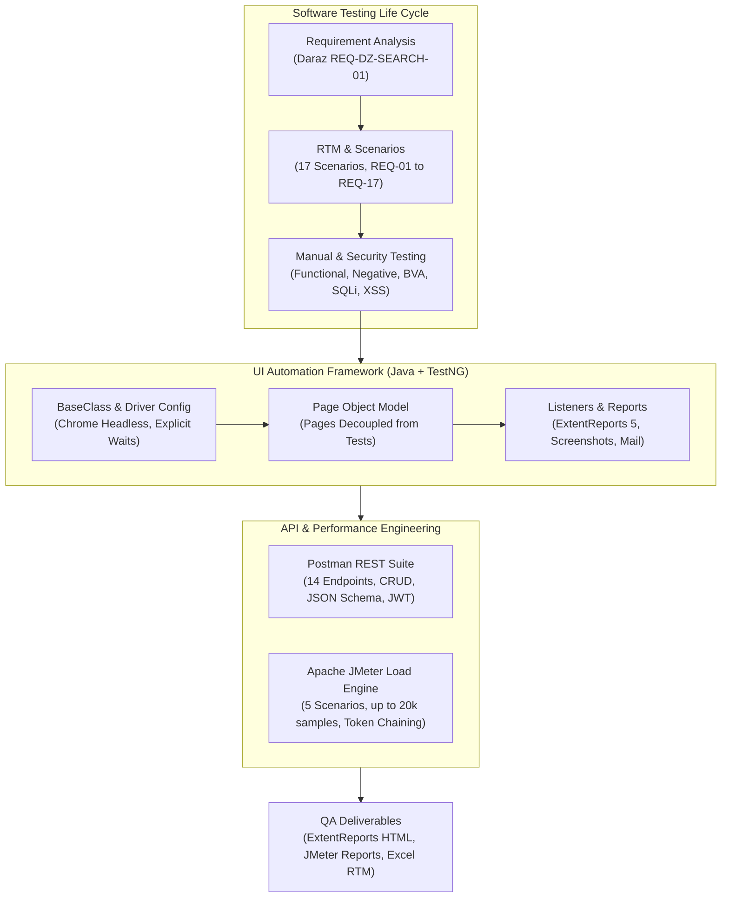

# Quality Assurance & Test Automation Portfolio

**Prasanga Niraula**  
QA Engineer | Test Automation & Performance Specialist  
Lalitpur / Kathmandu, Nepal | [prasanganiraula2016@gmail.com](mailto:prasanganiraula2016@gmail.com) | [Interactive Portfolio](./react-portfolio/)

---

[](https://www.oracle.com/java/)
[](https://www.selenium.dev/)
[](https://testng.org/)
[](https://maven.apache.org/)
[](https://www.postman.com/)
[](https://jmeter.apache.org/)
[](https://www.extentreports.com/)
[](https://www.jenkins.io/)

---

## Executive Summary

Quality Assurance Engineer with end-to-end expertise across the Software Testing Life Cycle (STLC), trained through the intensive QA & Automation program at [TechAxis](https://techaxis.com.np/).

Core capabilities include designing modular Page Object Model (POM) automation frameworks with Java, Selenium WebDriver, and TestNG; conducting automated REST API testing in Postman with dynamic scripting, JSON Schema validation, and JWT token chaining; performing multi-scenario concurrency and stress load testing with Apache JMeter (benchmarking up to 20,000 samples); and developing Requirement Traceability Matrices (RTM), functional test cases, and AppSec test scenarios.

---

## Technical Competencies

| Domain | Tools & Technologies | Core Methodologies |
| :--- | :--- | :--- |
| **Manual Testing** | Jira concepts, Excel, TestRail workflows | Equivalence Partitioning, Boundary Value Analysis, Decision Tables, Exploratory Testing, Smoke & Regression Testing |
| **UI Automation** | Java, Selenium WebDriver, TestNG, Maven, ExtentReports 5 | Page Object Model (POM), Headless Execution, Dynamic Locators, Screenshot Failure Listeners, Email Reporting |
| **API Testing** | Postman, REST APIs, JSON Schema (draft-07), Newman | CRUD Validation, Pre-request Scripts, JWT Token Chaining, Status & Response Time SLA Assertions |
| **Performance Testing** | Apache JMeter, HTTP Request Samplers, CSV Data Set Config | Concurrency & Stress Testing, Thread Groups, Ramp-Up Tuning, JSON Extractors, Random Timers, Latency Percentiles |
| **Security & Edge Testing** | OWASP Top 10 concepts, Input Sanitization | SQL Injection (`' OR 1=1 --`), XSS Payloads (`<script>`), Brute-force Lockout Verification, Session Inactivity Expiry |
| **CI/CD & Version Control** | Git, GitHub, Maven Surefire, Headless Chrome, Jenkins concepts | Automated Build Verification, XML Suite Runners, Test Artifact Generation |

---

## Architecture & Testing Workflow



---

## Featured Projects

### 1. Specification-Driven Manual Testing & Traceability (Daraz.com.np)
- **Directory:** [`Manual Test Cases /Daraz Manual/`](./Manual%20Test%20Cases%20/Daraz%20Manual/)
- **Key Artifacts:** [`DarazTestCases.xlsx`](./Manual%20Test%20Cases%20/Daraz%20Manual/DarazTestCases.xlsx), [`Requirements_Daraz_Search_Feature-239963.pdf`](./Manual%20Test%20Cases%20/Daraz%20Manual/Requirements_Daraz_Search_Feature-239963.pdf)
- **Overview:** End-to-end quality validation for the Product Search and Filter module on [Daraz.com.np](https://www.daraz.com.np/), derived from formal specification document `REQ-DZ-SEARCH-01`.
- **Test Design:**
  - **17 High-Level Scenarios (`TS-01` to `TS-17`):** Mapped directly to functional requirements (`REQ-01` to `REQ-17`).
  - **Granular Test Cases (`TC-01` to `TC-17d`):** Defined preconditions, step-by-step actions, test data sets, and expected outcomes.
  - **Traceability:** Requirement Traceability Matrix (RTM) linking functional requirements (`REQ-01` to `REQ-17`) to corresponding scenarios and execution statuses.
- **Coverage Areas:**
  - Search persistence, query matching, case-insensitivity, and dynamic auto-suggest dropdown.
  - Independent and compound multi-filter logic (Price Range, Brand, Rating >= 4 stars, Location, Free Shipping).
  - 5 sorting criteria: Popularity, Price (Low to High), Price (High to Low), Newest, Top Rating.
  - Product card verification: thumbnail, title accuracy, current price, promotional discount, average rating.
  - Negative and boundary conditions: empty results fallback, special character/emoji handling, whitespace trimming, and 3-second response time criteria.

---

### 2. Enterprise Authentication & Security Test Suite
- **Directory:** [`Manual Test Cases /Second/`](./Manual%20Test%20Cases%20/Second/)
- **Key Artifacts:** [`AssignmentEdited.xlsx`](./Manual%20Test%20Cases%20/Second/AssignmentEdited.xlsx), [`apitest1.csv`](./Manual%20Test%20Cases%20/Second/apitest1.csv)
- **Overview:** Functional and security assessment of an enterprise authentication module, evaluating credential validation, session rules, and vulnerability resistance.
- **Coverage Areas:**
  - **Functional Combinations:** Valid credentials, invalid credentials, mismatched pairs, and blank required-field submissions.
  - **Session Management:** Inactivity timeout and automatic session termination.
  - **Brute-Force Protection:** Account lockout verification following consecutive failed attempts (`TC-05`).
  - **Application Security (AppSec):**
    - SQL Injection (`' OR 1=1 --`) on input fields (`TC-09`).
    - Cross-Site Scripting (`<script>`) payloads in username and password fields (`TC-09a`).
    - Visual password character masking (`TC-04`).

---

### 3. Web UI Automation Frameworks (Java + Selenium WebDriver + TestNG)
- **Directory:** [`Automation/`](./Automation/)
- **Included Projects:**
  - **SauceDemo CI/CD Suite:** [`Automation/AutomationExam/`](./Automation/AutomationExam/)
  - **Automation Exercise Enterprise Suite:** [`Automation/AutomationQA/AutomationExercises/`](./Automation/AutomationQA/AutomationExercises/)
- **Technical Highlights:**
  - **Page Object Model (POM):** Decoupled page elements and interaction methods (`LoginPage.java`, `CartPage.java`) from test assertions (`LoginTestCases.java`, `CartTestCases.java`).
  - **Architecture Evolution:** Demonstrates migration from linear scripts (`WithoutPOM/TestCase1RegisterUser.java`) to scalable POM structures (`UsingPOM/`).
  - **Dynamic Data Generation:** Implemented `EmailsUtils.java` to generate unique timestamped email addresses (`"testuser" + System.currentTimeMillis() + "@gmail.com"`), preventing registration collisions.
  - **9-Case Decision Table:** Comprehensive login state validation on SauceDemo (Valid/Valid, Valid/Invalid, Valid/Empty, Invalid/Valid, Invalid/Invalid, Invalid/Empty, Empty/Valid, Empty/Invalid, Empty/Empty) with exact banner assertions.
  - **Cart Workflow:** Verifies item addition, dynamic button toggle to "Remove", item removal, and button restoration to "Add to cart".
  - **Headless CI/CD Driver:** `BaseClass.java` configured with Chrome options (`--headless=new`, `--no-sandbox`, `--disable-dev-shm-usage`, 1920x1080) for headless container/server execution.
  - **Reporting & Failure Capture:** Integrated ExtentReports 5 via `CustomTestListener.java` (`ITestListener`) and `ExtentReporterManagerSS.java` for automated failure screenshot capture and Jakarta Mail report dispatch.

```bash
# Run SauceDemo Suite
cd "Automation/AutomationExam" && mvn clean test

# Run AutomationExercise POM Suite
cd "Automation/AutomationQA/AutomationExercises" && mvn test -DsuiteXmlFile=src/test/java/AutomationTestCases/UsingPOM/testing.xml
```

---

### 4. REST API Testing & Automation (Postman + JSON Schema + Newman)
- **Directory:** [`API Testing/`](./API%20Testing/)
- **Key Artifact:** [`Platzi API.postman_collection.json`](./API%20Testing/Platzi%20API.postman_collection.json)
- **Target API:** Platzi Fake Store REST API (`https://api.escuelajs.co/api/v1/`)
- **Scope:** 14 automated requests covering product, category, pagination, and auth lifecycles.
- **Technical Capabilities:**
  - **CRUD Operations:** `GET /products`, `GET /products/:id`, `GET /products/slug/:slug`, `POST /products/`, `PUT /products/:id`, `DELETE /products/:id`.
  - **Dynamic Pre-Request Scripts:** Generates unique product titles per execution (`pm.variables.set("randomTitle", "Prasanga-" + Date.now())`).
  - **Variable Chaining:** Captures `id` from create response into `productId` for subsequent `PUT` and `DELETE` calls.
  - **JWT Authentication Chaining:** Authenticates via `POST /auth/login`, extracts `access_token`, and injects it as a Bearer token into `GET /auth/profile`.
  - **JSON Schema Validation (draft-07):** Validates array structure, required keys (`id`, `title`, `price`, `description`, `images`, `category`), and data types on `GET /products`.
  - **SLA & Status Assertions:** Validates HTTP status codes (`200 OK`, `201 Created`), response schemas, and SLA latency under 3500ms.

```bash
# Run Postman collection via Newman CLI
newman run "API Testing/Platzi API.postman_collection.json" -r cli,htmlextra --reporter-htmlextra-export api-report.html
```

---

### 5. Concurrency & Performance Testing (Apache JMeter)
- **Directory:** [`Jmeter/`](./Jmeter/)
- **Key Artifacts:** [`QA TechAxis.jmx`](./Jmeter/QA%20TechAxis.jmx), [`data.csv`](./Jmeter/data.csv), [`JmeterReportEdited.pdf`](./Jmeter/JmeterReportEdited.pdf)
- **Target Application:** RemoteAxle Authentication & User Profile APIs (`https://devapi.remoteaxle.com/`)
- **Test Design:**
  - **Data-Driven Execution:** `CSV Data Set Config` recycling 10 user credential records (`data.csv`). Includes 1 intentional invalid record to verify a controlled 10.00% baseline failure rate.
  - **Chained Samplers:** `POST /login` extracts JWT token via JSON Extractor (`$.data.access_token`), passed into `GET /users/profile` via `Authorization: Bearer ${token}`.
  - **Pacing & Timers:** Uniform Random Timer with 2000ms offset and 1000ms random delay:
    $$\text{Effective Delay} = (0.1 \times \text{Random Delay}) + 2000\,\text{ms}$$
  - **Assertions:** Response Code (200), Response Message, and Size assertions.

#### Execution Scenarios & Load Benchmark Results

| Scenario | Threads | Ramp-Up | Loop Count | Samples | Login Avg | Profile Avg | Login Err % | Profile Err % | Total Err % |
| :--- | :---: | :---: | :---: | :---: | :---: | :---: | :---: | :---: | :---: |
| **1 (Baseline)** | 1 | 1s | 1 | 2 | 754 ms | 212 ms | 0.00% | 0.00% | 0.00% |
| **2 (Light Load)** | 10 | 10s | 10 | 200 | 580 ms | 169 ms | 10.00% | 10.00% | 10.00% |
| **3 (Stress)** | 100 | 20s | 5 | 1,000 | 681 ms | 69 ms | 10.00% | 93.40% | 51.70% |
| **4 (Peak Stress)** | 200 | 20s | 10 | 4,000 | 3,930 ms | 74 ms | 10.00% | 91.35% | 50.68% |
| **5 (Sustained)** | 100 | 100s | 100 | 20,000 | 928 ms | 160 ms | 10.00% | 93.32% | 51.66% |

#### Key Performance Findings
1. **Token Authorization Bottleneck:** Login API error rate held steady at 10.00% across all scenarios (matching the single invalid row in the CSV). However, Profile API errors escalated to 91–93% under concurrency (Scenarios 3–5), indicating token handling and rate-limiting limits under load rather than credential issues.
2. **Latency at Peak Load:** At 200 threads (Scenario 4), Login API response time rose from 754ms baseline to an average of 3,930ms (99th percentile: 5,905ms; max: 9,389ms).
3. **Ramp-Up Impact:** Comparing Scenario 3 (20s ramp-up) against Scenario 5 (100s ramp-up) confirmed that gradual ramp-up reduces instantaneous thread contention on authentication services.

---

## Repository Structure

```plaintext
QA Portfolio/
├── API Testing/
│   ├── Platzi API.postman_collection.json
│   └── README.md
├── Automation/
│   ├── AutomationExam/
│   │   ├── pom.xml
│   │   ├── testng.xml
│   │   └── src/test/java/AutomationExam/
│   ├── AutomationQA/
│   │   └── AutomationExercises/
│   │       ├── pom.xml
│   │       ├── reports/
│   │       └── src/test/java/
│   └── README.md
├── Jmeter/
│   ├── QA TechAxis.jmx
│   ├── data.csv
│   ├── JmeterReportEdited.pdf
│   └── README.md
├── Manual Test Cases /
│   ├── Daraz Manual/
│   │   ├── DarazTestCases.xlsx
│   │   └── Requirements_Daraz_Search_Feature-239963.pdf
│   ├── Second/
│   │   ├── AssignmentEdited.xlsx
│   │   └── apitest1.csv
│   └── README.md
├── react-portfolio/
│   ├── package.json
│   ├── src/
│   └── index.html
├── index.html
└── README.md
```

---

## Quick Start & Test Execution

### UI Automation
```bash
# SauceDemo Suite
cd "Automation/AutomationExam"
mvn clean test

# Automation Exercise Suite
cd "Automation/AutomationQA/AutomationExercises"
mvn clean test
```

### API Testing
```bash
npm install -g newman newman-reporter-htmlextra
newman run "API Testing/Platzi API.postman_collection.json" -r cli,htmlextra
```

### JMeter Load Testing (CLI Mode)
```bash
jmeter -n -t "Jmeter/QA TechAxis.jmx" -l "Jmeter/results.jtl" -e -o "Jmeter/html-report"
```

---

## Contact

- **Prasanga Niraula**
- QA Engineer | Test Automation Specialist
- Email: [prasanganiraula2016@gmail.com](mailto:prasanganiraula2016@gmail.com)
- Interactive Portfolio: [react-portfolio/](./react-portfolio/)
